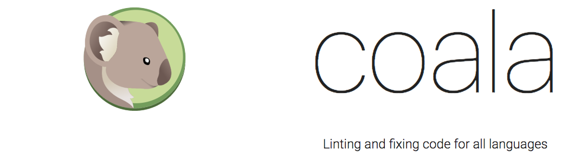
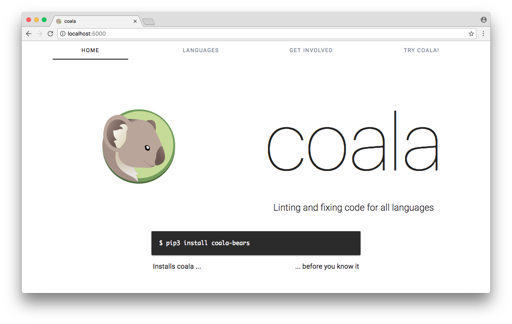
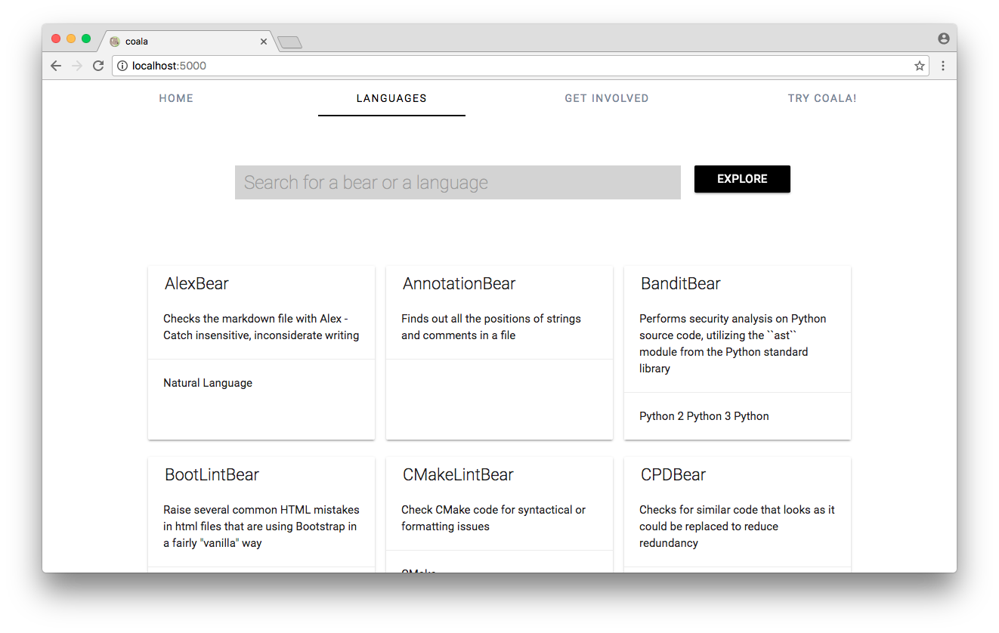
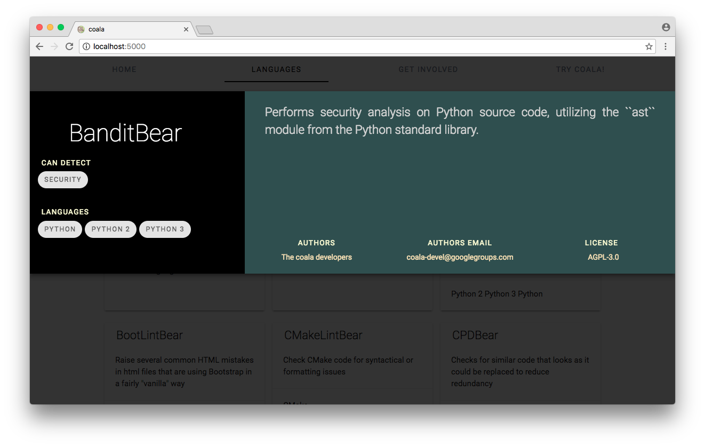
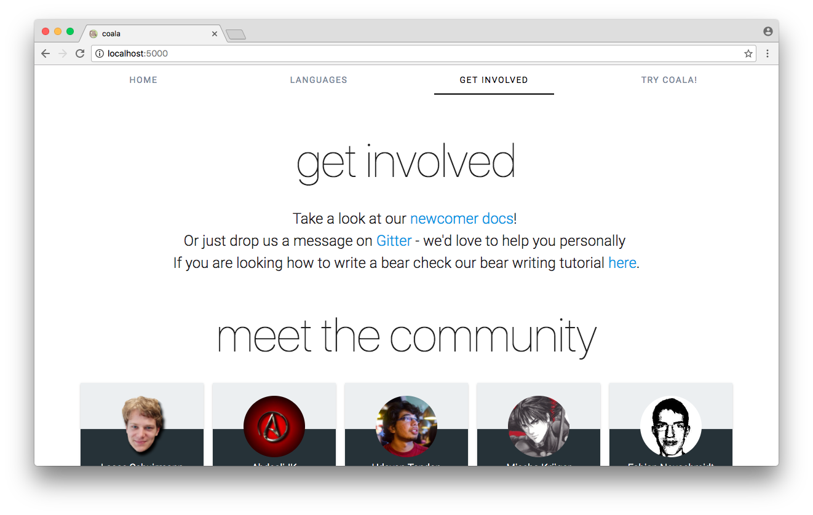
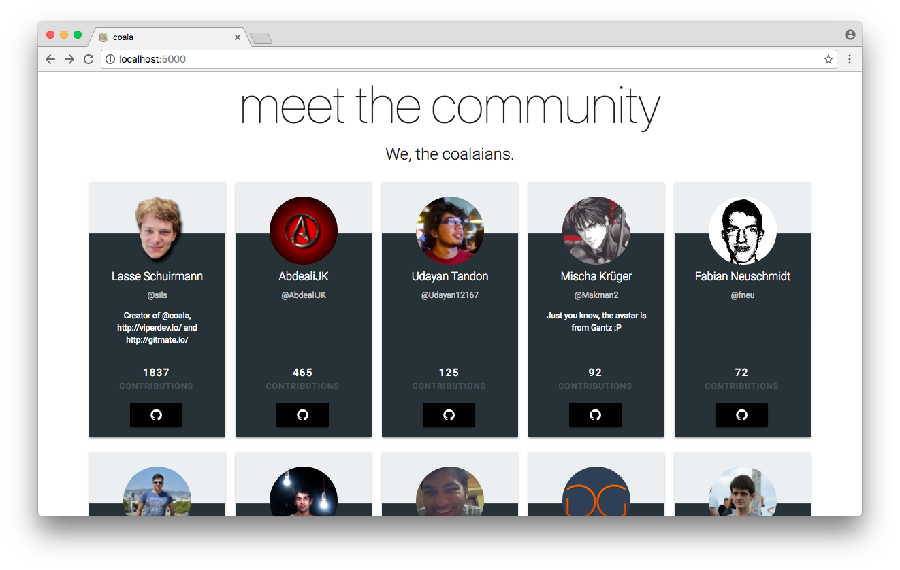

```
Hello! Welcome to the coala.io landing page of the future! (This is a WIP, the "website" repo is the current one.)
```
<br>


##Get Started

```
$ git clone https://github.com/coala/landing.git
$ cd landing
$ git checkout hemangsk/flask-api
$ bower install
$ pip install -r requirements.txt
$ export FLASK_APP=app.py
$ flask run
```
Hooray! The site is up and running at http://localhost:5000

-----

### Basic Structure
```
HOME TAB
```



```
LANGUAGES TAB
```



```
BEAR DETAILS VIEW
```



```
GET INVOLVED TAB
```



```
MEET THE COMMUNITY SECTION
```


-----

## Plans
[The Roadmap for coala.io](https://github.com/coala/landing/issues/15)

-----
## Contribution Guidelines
[Refer Here](https://github.com/coala/coala/blob/master/README.rst)


-----
## License

